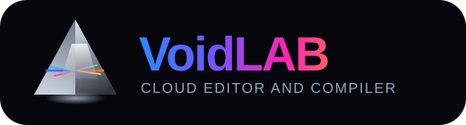

<p align="center">
  
</p>

<p align="center">
  A modern AI-powered web IDE built for real code execution, polished developer workflows, and premium product feel.
</p>

<p align="center">
  <a href="https://voidlab.vercel.app/">Live Product</a>
  |
  <a href="https://github.com/Voxion-Labs/VoidLAB">Repository</a>
</p>

---

## Overview

VoidLAB is a full-stack cloud coding environment designed to feel like a real premium product, not just a code editor running in the browser. It combines a Monaco-powered workspace, multi-file editing, online code execution, inline stdin handling for interactive programs, GitHub publishing, collaboration-ready tools, a built-in AI guide, and a polished high-end interface.

The project is structured as a standalone Next.js application and utilizes:

- a `Next.js` frontend for the complete product interface
- client-side execution capabilities via WebAssembly (WASM)
- Docker-based containerization for secure, isolated environments
- no traditional backend server or database

---

## What Is VoidLAB?

VoidLAB is a browser-based coding application for developers, learners, and builders who want one premium workspace for writing, importing, running, debugging, and managing code online.

At the product level, VoidLAB acts as:

- an online compiler for multiple languages
- a browser IDE with Monaco-powered editing
- a structured execution workspace with inline stdin support
- a developer tool hub with GitHub, collaboration, profile, and AI guidance features

---

## Problem It Solves

Most web-based compilers and lightweight online editors break down in the exact places that matter during real use:

- they feel too basic for serious coding workflows
- interactive input handling is clunky or unreliable
- execution output is hard to read
- publishing and collaboration are completely disconnected from the editor
- the product looks functional but not premium

VoidLAB is built to solve that by giving users a cleaner end-to-end workflow:

- write or import code
- run it in one click
- provide stdin inline when required
- get accurate output in a structured console
- continue working with GitHub, collaboration, and AI support inside the same product

---

## Links

- **Live Product**: [https://voidlab.vercel.app/](https://void-lab-web.vercel.app/)
- **GitHub Repository**: [https://github.com/Voxion-Labs/VoidLAB](https://github.com/Voxion-Labs/VoidLAB)

---

## Latest Product State

VoidLAB currently ships with:

- a unified console with `Output`, `Terminal`, and `Ports` tabs
- inline stdin capture for interactive programs instead of a clunky separate flow
- multi-language execution powered by WebAssembly and containerized environments
- dedicated feature pages for `Manual`, `GitHub`, `Collaboration`, `AI Guide`, and `Profile`
- personalized workspace UI with themes, activity context, and polished controls
- refreshed product documentation and visual demo assets in this repository

---

## Core Highlights

- Monaco-powered editor with multi-file workspace management
- support for many runnable and editor-focused languages
- inline stdin capture for interactive code execution
- unified output, terminal, and ports console
- direct GitHub publishing workflow from inside the workspace
- collaboration room interface for team workflows
- built-in AI guide for product walkthroughs and debugging help
- polished theme system across dark and light workspace modes
- responsive layout tuned for desktop and mobile

---

## Product Surface

### Workspace experience

- personalized workspace greeting
- active project shell with editor tabs and file explorer
- language switching, save, export, boilerplate, and run controls
- keyboard shortcuts for fast editing flow

### Execution experience

- client-side code execution through WebAssembly (WASM)
- isolated execution in containerized Docker environments for complex workloads
- inline stdin routing for input-based programs
- structured stdout, stderr, compile output, and runtime messages
- execution status, timing, and memory feedback

### Productivity tools

- built-in product manual
- GitHub publishing interface
- collaboration rooms
- AI guide
- profile management and workspace personalization

---

## Demo Gallery

<table>
  <tr>
    <td width="50%" valign="top">
      
      <br />
      <strong>1. Personalized workspace home</strong>
      <br />
      The main workspace gives users a premium first impression with a personalized greeting, feature hub, language card, file explorer, active code editor, and one-click run workflow.
    </td>
    <td width="50%" valign="top">
      
      <br />
      <strong>2. Execution and command workflow</strong>
      <br />
      This view highlights the execution area, command workflow, workspace shortcuts, and the output-focused development flow that powers coding inside VoidLAB.
    </td>
  </tr>
  <tr>
    <td width="50%" valign="top">
      
      <br />
      <strong>3. Collaboration rooms</strong>
      <br />
      VoidLAB includes a dedicated collaboration interface for creating rooms, inviting teammates, syncing shared workspace state, and preparing live teamwork features.
    </td>
    <td width="50%" valign="top">
      
      <br />
      <strong>4. GitHub publishing</strong>
      <br />
      The GitHub publishing page lets users connect GitHub, review the active file, choose a repository target, and prepare code for direct publishing from inside the product.
    </td>
  </tr>
  <tr>
    <td colspan="2" align="center" valign="top">
      
      <br />
      <strong>5. Built-in AI guide</strong>
      <br />
      The AI guide helps users with input-output handling, workspace structure, debugging direction, and onboarding support without leaving the platform.
    </td>
  </tr>
</table>

---

## Why VoidLAB

VoidLAB is built around a simple product promise:

- write code or import it
- click `Run`
- get clean, accurate execution feedback
- handle stdin inline when the program requires input
- keep the workflow inside one polished browser workspace

That simplicity drives the architecture, UI design, and execution flow across the entire product.

---

## Language Support

VoidLAB supports many languages and formats for editing, and a broad set of runnable languages through the execution engine.

### Runnable language examples

- JavaScript
- TypeScript
- Python
- Java
- C
- C++
- Go
- Rust
- PHP
- Ruby
- Swift
- Kotlin
- Bash
- Lua
- C#

### Editor-oriented formats

- HTML
- CSS
- JSON
- Markdown
- YAML
- SQL
- XML
- PowerShell

---

## Tech Stack

### Frontend & Client Execution

- Next.js `16.2.4`
- React
- TypeScript
- Tailwind CSS
- Monaco Editor
- WebAssembly (WASM)

### Environment Infrastructure

- Docker for containerized environments
- No traditional backend framework (Serverless execution model)
- No traditional database (Fully client-side state handling)

### Platform and deployment

- Vercel for frontend hosting

---

## Repository Structure

```text
VoidLAB/
|- public/
|  |- assets/
|  `- ...
|- src/
|  |- app/
|  |- components/
|  |- context/
|  |- hooks/
|  `- lib/
|- docs/
|  `- readme/
|- docker-compose.yml
|- package.json
|- package-lock.json
`- README.md
```

---

## Architecture

### Frontend responsibilities

- onboarding and direct entry experience
- profile and workspace personalization
- file management and editor interactions
- console, output, and terminal presentation
- GitHub publishing UI
- collaboration and AI tool pages
- isolated execution logic via WebAssembly
- managing containerized orchestration for external environments

### Execution flow

1. User opens VoidLAB.
2. User writes code or imports files into the workspace.
3. User clicks `Run`.
4. If the program expects input, VoidLAB asks for stdin inline in the output area.
5. Code is executed natively in the browser using WebAssembly or dispatched to a secure Docker container for isolated execution.
6. VoidLAB returns normalized output, errors, and status details back to the workspace.

---

## Validation Snapshot

The latest verified repo state includes:

- lint passing
- typecheck passing
- production build passing

---

## Authentication and GitHub

- direct entry flow without leaving the app
- optional Google, GitHub, and X login support
- GitHub connect plus repository publishing support
- visible repository target and publishing controls inside the workspace

---

## Key Capabilities

- polished onboarding and workspace personalization
- shareable public product URL
- cloud editor workflow
- inline stdin-based execution for interactive programs
- GitHub repository publishing support
- responsive design
- project tabs and file explorer
- dedicated tool pages for manual, profile, AI guide, GitHub, and collaboration
- professional UI suitable for demos, portfolio presentation, and product showcases
- clean standalone Next.js structure for optimal deployment

---

## Current Scope

VoidLAB is built as a strong production-style application with:

- multi-language editing
- broad execution support
- a modern UI
- fully client-side WASM execution architecture
- real auth options
- GitHub publish flow
- live deployment links
- product-level workspace tooling

---

## Local Setup

### Prerequisites

- Node.js 18+
- npm 10+
- Docker (for executing containerized environments)

### Install dependencies

```bash
npm install
```

### Environment

Create `.env.local`:

```env
# Optional environment variables
```

### Run frontend

```bash
npm run dev
```

### Local URLs

- Frontend: `http://localhost:3000`

---

## Build Commands

### Build web

```bash
npm run build
```

---

## Deployment

### Frontend deployment

- hosted on `Vercel`
- root directory: `./` (Root of the repository)

---

## License

VoidLAB is protected under a custom restricted license.

The full license text is available in [LICENSE](LICENSE).

License summary:

- copyright © 2026 Rudranarayan Jena
- all rights reserved
- no copying, modification, distribution, hosting, reuse, or derivative work without prior written permission
- no commercial or non-commercial use is allowed unless explicitly approved by the author

VoidLAB is not released as an open-source project under MIT, Apache, GPL, or any other permissive/public license.

---

## Author

<p align="center">
  
</p>

<p align="center">
  <strong>Rudranarayan Jena</strong>
</p>

<p align="center">
  Founder @ <a href="http://github.com/Voxion-Labs">Voxion Labs</a>
</p>

<p align="center">
  <a href="https://github.com/liambrooks-lab">GitHub: @liambrooks-lab</a>
</p>

---
